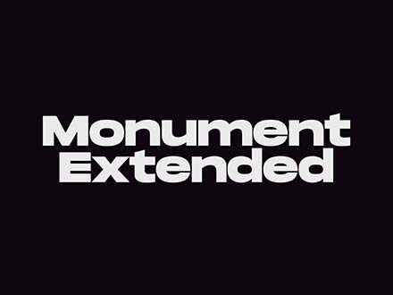
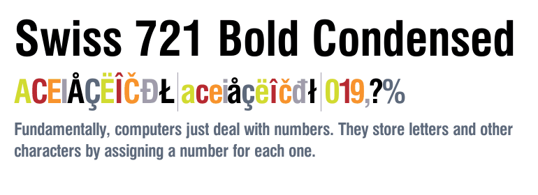

# portfolio-site

The repository is the source code of my personal portfolio website. [Visit My Portfolio](https://flaviaouyang.github.io/portfolio-site/)

## Technology Used

- HTML
- CSS
- Figma

## Work Flow

- Designed wireframe, sitemap, and UI using Figma
- Constructed basic layout of the site with HTML
- Added basic style to site using CSS

## Repo Structure

- README
- [font folder](/font): stores fonts used for the site
  - Monument Extended

  - Swiss 721

- [img folder](/img)
- [UI folder](/ui): store the pdf files of the wireframe and UI designs for the site
- scripts:
  - HTML
  - CSS

## Issues

- 12/26/2021: font does not work in Safari (FIXED)
- 12/26/2021: font-decoration underline dashed does not work in Safari (FIXED)
- 12/26/2021: nav bar fixed position does not work, will take it out of flexbox workflow (FIXED)
- 01/06/2022: Favicon does not work with Safari

## `TODO`

- [ ] change the layout of blog posts section
- [ ] responsive design for mobile users

