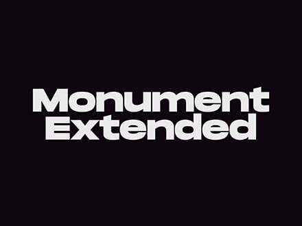
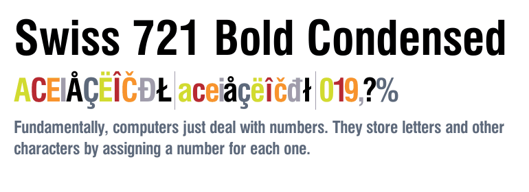

# PORTFOLIO

The repository is the source code of my personal portfolio website. 
 
[VISIT MY PORTFOLIO HERE](https://flaviaouyang.github.io/portfolio-site/)

## TECHNOLOGY AND TOOLS

- HTML
- CSS
- JavaScript
- React
- Figma

## WORK FLOW

- Designed wireframe, sitemap, and UI using Figma
- Constructed basic layout of the site with HTML
- Added basic style to site using CSS
- Refactored Code for React
- Added projects and minor changes in styles. (Ready to deploy)

## PROGRESS

- Stage 1   

 

- Stage 2   

 

## TYPOGRAPHY

- Monument Extended 

- Swiss 721 

## RUN ON YOUR MACHINE

- clone this repository: `git clone https://github.com/flaviaouyang/portfolio-site.git`
- navigate to the cloned repository: `cd portfolio-site`
- run using npm: `npm start`
- a webpage should automatically open
  - if not, visit: http://localhost:3000

## ISSUE

- 12/26/2021: font does not work in Safari **(FIXED)**
- 12/26/2021: font-decoration underline dashed does not work in Safari **(FIXED)**
- 12/26/2021: nav bar fixed position does not work, will take it out of flexbox workflow **(FIXED)**
- 01/06/2022: Favicon does not work with Safari **(FIXED)**
- 01/10/2022: nav bar overlaps with some texts, looks careless **(FIXED)**

## `TODO`

- [x] add animated and interactive background
- [x] change the layout of blog posts section
- [ ] responsive design for mobile users

